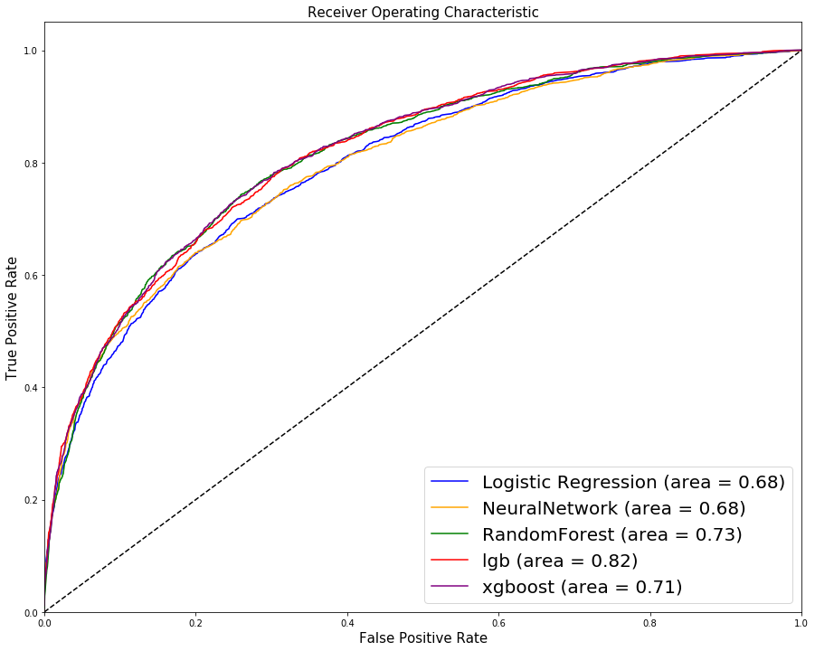

## Classification Model Comparison & Hierarchical Clustering
This repository focues on classification model comparison for classifying whether customers buy organic products.

### Business Scenario
A supermarket is offering an organic product to customers and it wants to know what factors have the most impact on customers purchasing organic products. The supermarket also wants to segment customer groups for marketing purposes and to identify potential customers who will buy organic products.

### Classification Model Comparison
Compare the classification results based on the following models:
- LightGBM, RandomForest, XGBoost, LogisticRegression, Neural Network  

ROC Curve Overview by Models

### Hierarchical Clustering
This section focuses on using hierarchical clustering to segment the customer profiles and explore significant difference between segments for informing better marketing strategy. 

